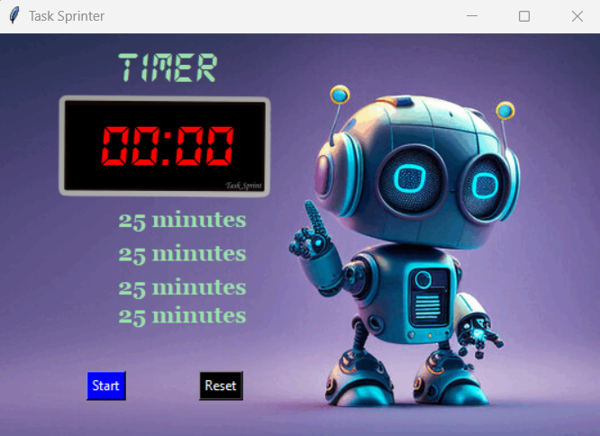
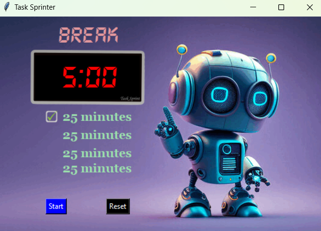
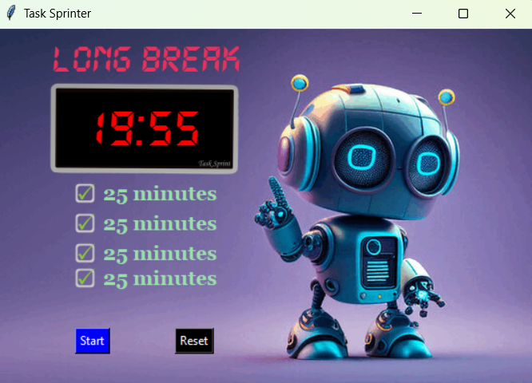

# Task Sprinter ⏳

**Task Sprinter** is a simple productivity timer app, designed using Python's `Tkinter` module, that follows the Pomodoro technique. It helps you stay productive by working in focused intervals, followed by short and long breaks. It also displays a checkmark image after each completed work session to motivate the user.

## Features
- Timer for 25-minute work intervals.
- 5-minute short breaks and 20-minute long breaks after multiple sessions.
- Displays a checkmark image after every work session.
- Customizable and intuitive UI using `Tkinter`.
- Visual and text-based feedback on your progress.
- Fully customizable background, fonts, and colors.

## Screenshots



## Getting Started

### Prerequisites
To run the **Task Sprinter** app, ensure you have Python installed along with the following libraries:
- `tkinter` (comes pre-installed with Python)

## Installation

1. **Clone the Repository**:
   ```bash
   git clone https://github.com/tusharharyana/Task-Sprinter.git

2. **Navigate to the directory**:

    ```bash
    cd Task-Sprinter
    ```
3. **Run the application**:
    ```bash
    python main.py
    ```

## Contributing

Feel free to open issues or submit pull requests if you have suggestions for improvements or enhancements.


## Contact

For any questions or feedback, please reach out to [haryanatushar@gmail.com](mailto:haryanatushar@gmail.com).   